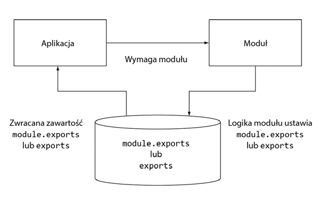

# backend

Back-end test application

# Co to jest Node.js?

Node.js to platforma dla kodu JavaScript działającego po stronie serwera w sposób asynchroniczny oparta o zdarzenia.

Język JavaScript stosowany na serwerze działa praktycznie tak samo, w jaki przeglądarka internetowa dostarcza
JavaScript klientowi.

Node i przeglądarka internetowa działają na podstawie zdarzeń (używają pętli zdarzeń) oraz nieblokujące operacji
wejścia i wyjścia (używają asynchronicznych operacji we-wy)

Platforma Node:

* została zbudowana na podstawie języka JavaScript;
* jest asynchroniczna i oparta na zdarzeniach;
* została zaprojektowana dla aplikacji działających w czasie rzeczywistym i korzystających z ogromnej ilości danych.

Podobnie jak każda inna technologia, także platforma Node nie jest **panaceum** na wszystko. Pomaga jednak w rozwiązaniu
pewnych problemów, a także otwiera nowe możliwości.

# 3. Podstawy programowania w Node

Problem związany z organizacją kodu jest znany większości doświadczonych programistów. Pod względem koncepcyjnym logika jest umieszczana w klasach i funkcjach. Pliki zawierające klasy i funkcje znajdują się w katalogach w ramach struktury drzewa. Ostatecznie kod jest organizowany w postaci aplikacji i bibliotek. System modułów Node oferuje potężny mechanizm pozwalający na organizację kodu, a sposób wykorzystania go będzie przedstawiony poniżej.

## 3.1 Organizacja i wielokrotne użycie kodu Node

Umieszczenie całego kodu aplikacji w jednym pliku okazuje się niefektywne. Lepszym podejściem jest pogrupowanie
powiązanej ze sobą logiki i przeniesienie jej do osobnym plików.

Nawigacja po kodzie staje się łatwiejsza po jego organizacji za pomocą katalogów i oddzielnych plików zamiast umieszczenia całej aplikacji w jednym dużym pliku.

W pewnych implementacjach języków, takich jak `PHP i Ruby`, wczytanie logiki z innego pliku (nazywanego wówczas plikiem „dołączonym”) może oznaczać, że cała logika wykonywana z pliku dołączonego wpływa na przestrzeń globalną. Istnieje więc ryzyko, że utworzone zmienne i funkcje zadeklarowane w pliku dołączonym nadpiszą te utworzone i zadeklarowane w aplikacji.

W języku `PHP` można tego uniknąć dzięki zastosowaniu *przestrzeni nazw*, natomiast `Ruby` oferuje podobną funkcjonalność dzięki *modułom*. Jednak Node unika potencjalnego problemu, ponieważ nie oferuje łatwego sposobu na przypadkowe umieszczenie kodu w globalnej przestrzeni nazw.

Moduły `Node` łączą kod i ułatwiają jego wielokrotne użycie, ale nie zmieniają zasięgu globalnego.

Moduły Node pozwalają wskazać w dołączanym pliku funkcje i zmienne, które mają być udostępnione aplikacji. Jeżeli moduł zwraca więcej niż tylko jedną funkcję lub zmienną, wtedy można je wskazać za pomocą właściwości obiektu o nazwie exports. W przypadku zwrotu tylko pojedynczej funkcji lub zmiennej można ustawić właściwość o nazwie module.exports. Mechanizm rozwiązania pokazano na rysunku.



Rysunek. Ustawienie właściwości `module.exports` obiektu `exports` pozwala modułowi na wskazanie komponentów,
które powinny być współdzielone z aplikacją.

Unikając umieszczania kodu w zasięgu globalnym, system modułów `Node` unika konfliktów nazw oraz ułatwia
wielokrotne użycie kodu. Moduły mogą być publikowane w repozytorium menedżera `npm`, czyli dostępnej w internecie kolekcji modułów `Node` gotowych do użycia. Wspomniane moduły są tworzone przez społeczność `Node`. Użytkownik
modułu nie musi się martwić, że funkcja lub zmienna modułu spowoduje nadpisanie innej.

### 3.1.1. Tworzenie modułu

Moduł może mieć postać pojedynczego pliku lub katalogu zawierającego jeden lub więcej plików. Jeżeli moduł ma
postać katalogu, plik w katalogu modułu powinien mieć nazwę `app.js`, choć można to zmienić w pliku `package.json`.

W celu utworzenia typowego modułu konieczne jest przygotowanie pliku definiującego właściwości obiektu `exports` wraz z danymi dowolnego rodzaju, na przykład ciągami tekstowymi, obiektami i funkcjami.

Przykład prostego modułu:

```javascript
//  currency.js
const canadianDollar = 0.91;

function roundTwoDecimals(amount) {
  return Math.round(amount * 100) / 100;
}

exports.canadianToUS = function (canadian) {
  return roundTwoDecimals(canadian * canadianDollar);
};

exports.USToCanadian = function (us) {
  return roundTwoDecimals(us / canadianDollar);
};

```
Aby wykorzystać utworzony moduł, należy użyć oferowanej przez `Node` funkcji `require()`, której argumentem jest ścieżka dostępu do modułu. `Node` przeprowadza wyszukiwania synchroniczne w celu zlokalizowania modułu, a następnie wczytuje jego zawartość.

>**Informacje dotyczące funkcji `require()` i synchronicznych operacji wejścia-wyjścia**<br>
>Funkcja `require()` to jedna z kilku synchronicznych operacji wejścia-wyjścia dostępnych w `Node`. Ponieważ
>moduły są często używane, a wczytujące je polecenia najczęściej umieszczane na początku pliku to synchroniczne
>działanie funkcji `require()` pomaga w zachowaniu jasności, porządku i czytelności kodu.
> <br>

>Unikaj użycia funkcji `require()` we fragmentach aplikacji przeprowadzających dużą ilość operacji wejścia-wyjścia.
>Wywołanie synchroniczne uniemożliwi `Node` wykonywanie innych działań aż do chwili zakończenia wywołania. Na przykład
>jeżeli masz działający serwer `HTTP`, wtedy użycie funkcji `require()` do obsługi wszystkich żądań przychodzących
>spowoduje ogromny spadek wydajności. Dlatego też funkcja `require()` i inne operacje synchroniczne
>są używane jedynie podczas początkowego wczytywania aplikacji.


Zawartość pliku `test-currency.js`, który wymaga modułu `currency.js.`

```javascript
  const currency = require('./currency');

  console.log(
    `50 dolarów kanadyjskich odpowiada następującej ilości dolarów amerykańskich: 
    ${currency.USToCanadian(50)`}
  );
```

### 3.1.2. Dostrajanie tworzenia modułu za pomocą module.exports

```javascript
const Currency = function (canadianDollar) {
  this.canadianDollar = canadianDollar;
};

Currency.prototype.roundToDecimals = function (amount) {
  return amount.toFixed(2);
};

Currency.prototype.canadianToUS = function (canadian) {
  return this.roundToDecimals(canadian * this.canadianDollar);
};

module.exports = Currency;
```
Być może sądzisz, że w przypadku modułu oferującego aplikacji pojedynczą funkcję lub zmienną można po prostu przypisać obiektowi `exports` komponent, który ma zostać zwrócony aplikacji. Jednak takie rozwiązanie nie działa, ponieważ `Node` nie pozwala na ponowne przypisanie `exports` innemu obiektowi, funkcji lub zmiennej. Gdybyśmy w powyższym kodzie zamiast
`module.exports = Currency;` napisali `exports = Currency;` to obiekt `exports` zostanie zignorowany, gdyż wartością zwrotną jest wartość `module.exports`.

> **Co tak naprawdę zostanie wyeksportowane?**
>Komponenty ostatecznie udostępniane aplikacji są definiowane przez `module.exports`.
Obiekt `exports` jest ustawiany jako po prostu globalne odniesienie do `module.exports`,
początkowo zdefiniowane jako pusty obiekt, do którego możesz dodawać właściwości.
Tak więc `exports.nazwaFunkcji` stanowi skrót dla `module.exports.nazwaFunkcji`.

>Dlatego też jeśli obiektowi `exports` zostało przypisane cokolwiek innego, automatycznie
powoduje zerwanie odniesienia między `module.exports` i `exports`. Ponieważ wartość zwrotna
jest definiowana przez `module.exports`, obiekt `exports` nie działa dłużej zgodnie z oczekiwaniami,
to znaczy nie zawiera odniesienia do `module.exports`. Jeżeli chcesz zachować wspomniane
odniesienie, musisz spowodować, aby `module.exports` ponownie odwoływał się do
`exports`: <br>

```javascript
  module.exports = exports = Currency;
```

# 4. Express.js

## Przesyłanie plików
W Expressie pliki przesyłamy za pomocą metody `res.sendFile()`. Należy jako parametr podać 
ścieżkę do pliku, jako drugi parametr można podać obiekt opcji.  

## Ustawianie nagłówków

Nagłówki ustawiamy za pomocą metody `res.set()` np:

```javascript
rest.set('Content-Type': 'text/plan');

res.set({
  'Content-Type': 'text/html',
  'Content-Length: '123'
})
```

## Ciasteczka

Pozwalają zapamiętywać krótkie informacje — np. identyfikatory, informacje 
typu zalogowany czy nie — na urządzeniu klienta.
Ustawianie ciasteczek sprowadza się do ustawienia odpowiednich nagłówków, 
za pomocą funkcji `res.cookie()`:

```javascript

app.get("/hi/:name", (req, res) => {
  const { name } = req.params;
  const dt = new Date();
  
  dt.setDate(dt.getDate() + 7);
  res.cookie("visitor_name", name, { expires: dt });
  res.send("Imię zapisano");
});

```

Za pomocą trzeciego argumentu:

* `domain` - domena, do której będą wysyłane ciasteczka
* `expires` - czas do kiedy, ciastko ma być zapamiętane
* `maxAge` - określa jak długo ciastko ma istnieć w ms
* `httpOnly` - jeśli ustawione na `true`, front-end nie dostępu do ciastka

Stworzone wcześniej ciastko możemy usunąć metodą `res.clearCookie()` z argumentem zawierającym nazwę ciasteczka. 
Opcjonalnie można podać drugi argument, taki jak dla `res.cookie()`. 

## Middleware

Zapytanie od klienta `HTTP Request` przechodząc przez `Express` przechodzi przez ścieżki (`Matched Route`), 
następnie przez `Middleware` np. (`CORS`, `CSRF`, `Auth` ) , później tworzy się `Main Task` i tak przetworzone 
żądanie zmienia się w odpowiedź, która jest wysyłana do klienta `HTTP Response`.

Middleware są to kolejne warstwy, łączące nasze zapytanie w odpowiedz. Służą do odkodowania treści lub do odebrania 
jakichś plików.

Obiekt `app` reprezentujący aplikację w `Express.js` ma metodę `app.use()` za pomocą której możemy zarejestrować 
`middleware`:

```javascript
  app.use(someMiddleware());
```


